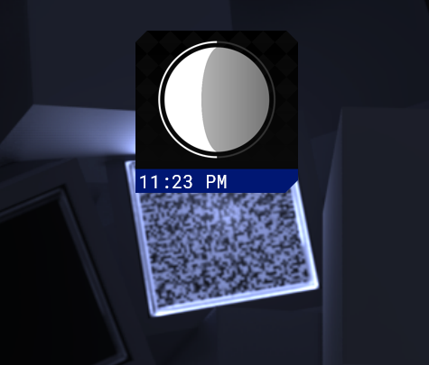

# Modernaz Moon + clock

This is a moon phase and clock made for Rainmeter. It follows one of my design languages and takes the moon phase information from [FarmSense](https://farmsense.net)'s Moon Phase API. It might be inaccurate only for a few different moments, but that's alright.

I'm talking about the moon, not the clock.

Of course, you'd focus more on the moon if you were a ``werewolf``...

The widget is responsive, you can edit the ``Size`` attribute in ModernazMoon.ini and it will scale accordingly.

## Installation
Go to the Releases tab and download the latest zip. Then, extract said zip in your Rainmeter skins folder.

After that, enable "ModernazMoon" in your skin settings.

## LICENSE
MIT, except for the image assets themselves, these are Creative Commons BY-SA-ND 4.0.